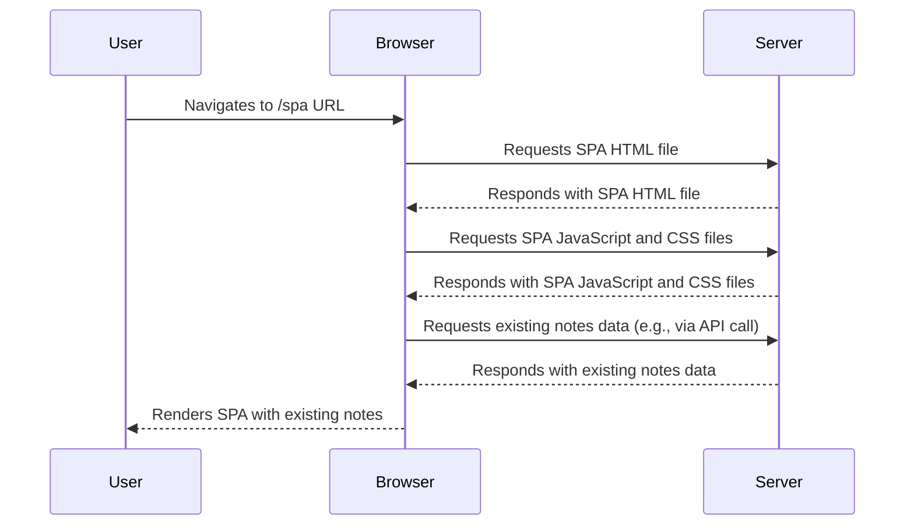

# Single-Page App Diagram

```mermaid
sequenceDiagram
    participant User
    participant Browser
    participant Server

    User->>Browser: Navigates to /spa URL
    Browser->>Server: Requests SPA HTML file
    Server-->>Browser: Responds with SPA HTML file
    Browser->>Server: Requests SPA JavaScript and CSS files
    Server-->>Browser: Responds with SPA JavaScript and CSS files
    Browser->>Server: Requests existing notes data (e.g., via API call)
    Server-->>Browser: Responds with existing notes data
    Browser-->>User: Renders SPA with existing notes
```
