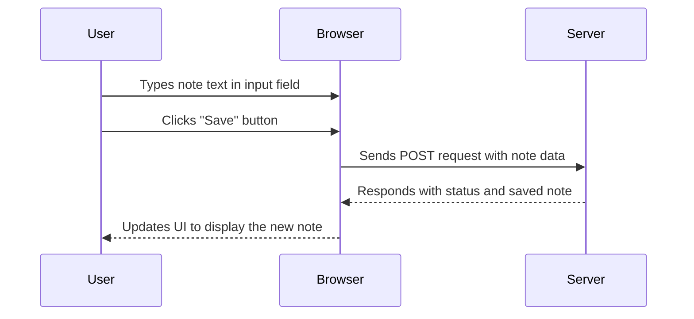

# New Note on Single-Page App Diagram

```mermaid
sequenceDiagram
    participant User
    participant Browser
    participant Server

    User->>Browser: Types note text in input field
    User->>Browser: Clicks "Save" button
    Browser->>Server: Sends POST request with note data
    Server-->>Browser: Responds with status and saved note
    Browser-->>User: Updates UI to display the new note

```
